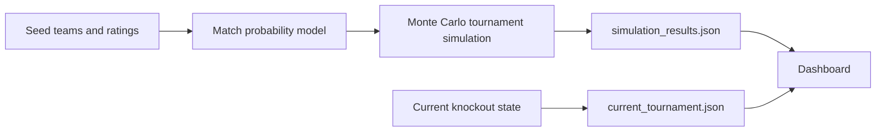

<div align="center">


[](https://www.python.org/)
[](dashboard/)
[](outputs/simulation_results.json)
[](data/current_tournament.json)

**A World Cup 2026 prediction lab with Python simulations, live knockout context, and a custom command-center dashboard.**

</div>

---

## Overview

**CupCast 2026** is a data-driven World Cup forecasting project. It combines a Python match simulator, Monte Carlo tournament engine, current knockout-state tracking, and a polished browser dashboard for exploring tournament probabilities.

The project is built to feel like a compact sports intelligence room: title odds, team profiles, region race, live quarterfinal matchups, and alternate scenario paths from the quarterfinals through the final.

> The included `data/teams_seed.csv` is a starter dataset for experimentation. Replace it with official teams, ratings, injuries, lineups, betting-market priors, or Elo values for stronger real-world modeling.

## Current Tournament State

As of **July 8, 2026**, the Round of 16 is complete and the dashboard tracks the quarterfinal field from `data/current_tournament.json`.

| Quarterfinal | Matchup | Path |
| --- | --- | --- |
| QF1 | Morocco vs France | Morocco 3-0 Canada / France 1-0 Paraguay |
| QF2 | Norway vs England | Norway 2-1 Brazil / England 3-2 Mexico |
| QF3 | Spain vs Belgium | Spain 1-0 Portugal / Belgium 4-1 United States |
| QF4 | Argentina vs Switzerland | Argentina 3-2 Egypt / Switzerland advanced 4-3 on penalties |

## Dashboard Highlights

<table>
  <tr>
    <td width="50%">
      <h3>Live Knockout Tracker</h3>
      <p>Shows the completed Round of 16, the next quarterfinal matchups, and the teams already eliminated.</p>
    </td>
    <td width="50%">
      <h3>Quarterfinal Scenario Paths</h3>
      <p>Generates alternate paths from quarterfinals to semifinals to final, including favorite, upset, and balanced routes.</p>
    </td>
  </tr>
  <tr>
    <td width="50%">
      <h3>Title Probability Table</h3>
      <p>Search, sort, and filter teams by champion odds, final odds, group winner odds, and rating.</p>
    </td>
    <td width="50%">
      <h3>Team Odds Profile</h3>
      <p>Click any team to inspect champion, final, semifinal, quarterfinal, knockout, and group odds.</p>
    </td>
  </tr>
  <tr>
    <td width="50%">
      <h3>Region Title Race</h3>
      <p>Summarizes confederation-level title share from the simulation output.</p>
    </td>
    <td width="50%">
      <h3>Model Insights</h3>
      <p>Surfaces favorites, group locks, longshots, and upset-watch teams from the generated results.</p>
    </td>
  </tr>
</table>

## How It Works



The simulator uses team ratings, attack strength, and defensive strength to estimate goals, simulate scores, advance teams through groups and knockouts, and export probability summaries.

## Quick Start

Run a fresh simulation:

```powershell
python scripts/run_simulation.py --iterations 10000
```

Or use the helper script:

```powershell
.\scripts\run_simulation.ps1 10000
```

Start the local dashboard:

```powershell
.\scripts\start_dashboard.ps1 8000
```

Then open:

```text
http://127.0.0.1:8000/dashboard/
```

## Project Structure

```text
CupCast2026/
  data/
    current_tournament.json
    teams_seed.csv
  dashboard/
    index.html
    styles.css
    app.js
    data.js
  outputs/
    simulation_results.json
  scripts/
    run_simulation.py
    run_simulation.ps1
    start_dashboard.ps1
  src/
    worldcup2026/
      data_loader.py
      ratings.py
      simulate.py
```

## Output Data

The simulator writes two dashboard-ready files:

| File | Purpose |
| --- | --- |
| `outputs/simulation_results.json` | Main simulation output with team odds, region odds, insights, and sample bracket data. |
| `dashboard/data.js` | Browser fallback so the dashboard still works when opened directly. |

The live tournament file is maintained separately:

| File | Purpose |
| --- | --- |
| `data/current_tournament.json` | Current knockout stage, Round of 16 results, quarterfinal matchups, and source links. |

## Model Roadmap

- Replace seed ratings with Elo, SPI-style ratings, FIFA ranking blend, or betting-market priors.
- Add recent match data, squad strength, injuries, rest days, travel, and venue adjustments.
- Backtest the model against previous international tournaments.
- Add confidence intervals and sensitivity analysis for each team.
- Add a hosted version of the dashboard.

## Notes

This is a forecasting and simulation project, not an official tournament data provider. The model is only as good as the inputs, so treat seed ratings as a starting point and improve them as better data becomes available.

<div align="center">


</div>
